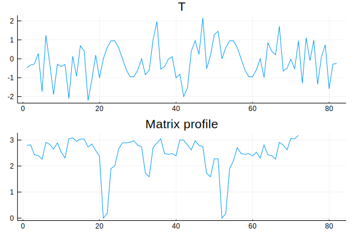
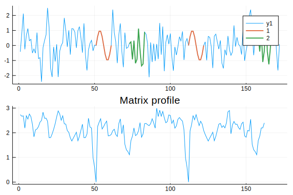
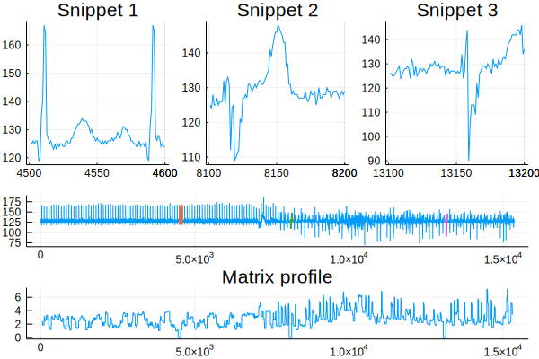

# MatrixProfile

[](https://github.com/baggepinnen/MatrixProfile.jl/actions)
[](https://codecov.io/gh/baggepinnen/MatrixProfile.jl)

Time-series analysis using the matrix profile. The matrix profile `P` tells you which sub-sequences of a time series `T` are similar to each other, and which are most dissimilar from all other. This will allow you to find repeated patterns, or *motifs*, as well as finding outliers and anomalies. Here's a blog post that introduces the matrix profile with lots of nice figures and examples: https://towardsdatascience.com/introduction-to-matrix-profiles-5568f3375d90


### Installation
This package is registered and can be installed with
```julia
using Pkg
pkg"add MatrixProfile"
```

## Usage
The function `matrix_profile` returns the matrix profile and profile indices. Here's an example where we insert a repeated pattern in an otherwise random time series.
```julia
using MatrixProfile, Plots
t  = range(0, stop=1, step=1/10)
y0 = sin.(2pi .* t)
T  = [randn(20); y0; randn(20); y0; randn(20)]
window_length = length(y0)
profile = matrix_profile(T, window_length)
plot(profile) # Should have minima at 21 and 52
```


The matrix profile have two sharp minima at the onsets of the repeated pattern. The parameter `window_length` determines how long pattern to search for.

### Analysis across different time-series
If called like
```julia
profile = matrix_profile(A, B, m, [dist])
```
consecutive windows of `A` will be compared to the entire `B`. The resulting matrix profile will have a length that depends on `B`, and indicate with small values when a window of `A` appeared in `B`, and with large values when no window in `A` matched the corresponding window in `B`. This is not a symmetric function, in general, `matrix_profile(A, B) != matrix_profile(B, A)`.

### Runtime
`matrix_profile` benefits greatly in speed from the use of `Float32` instead of `Float64`, but may accumulate some error for very long time series (> 10⁶ perhaps). The computational time scales as the square of the length of `T`, but is invariant to the window length. Calculating the matrix profile of `2^17 ≈ 100k` points takes less than minute on a laptop.

If `dist` is provided, a generic (slow) method is used. If `dist` is not provided and the inputs `A,B` are one dimensional vectors of numbers, a fast method is used. The fast method handles long time series, `length(A) = length(B) = 100k` takes less than 30s.

If the time-series is sampled very fast in relation to the time scale on which interesting things happen, you may try the function [`resample(T, fraction::Real)`](https://juliadsp.github.io/DSP.jl/stable/filters/#DSP.Filters.resample) to reduce the amount of data to process. Example, `resample(T, desired_samplerate/original_samplerate)`.

## Motif grouping
Using the fake data from the example above, we can do
```julia
k = 2
mot = motifs(profile, k; r=2, th=5)
plot(profile, mot)
# plot(mot) # Motifs can be plotted on their own for a different view.
```
- `k` is the number of motifs to extract
- `r` controls how similar two windows must be to belong to the same motif. A higher value leads to more windows being grouped together.
- `th` is a threshold on how nearby in time two motifs are allowed to be.


Also see the function `anomalies(profile)` to find anomalies in the data, sometimes called *discords*.


## Arbitrary metrics and input types
The matrix profile can be computed for any sequence of things that has a "time axis" and a notion of distance. The examples so far have dealt with one-dimensional arrays of real numbers with the Euclidean metric, for which the matrix profile is particularly efficient to compute. We do not have to limit ourselves to this setting, though, and `matrix_profile` accepts any array-like object and any distance function on the form `dist(x,y)`. The interface looks like this
```julia
profile = matrix_profile(T, m, dist)
```
If `T` is a high-dimensional array, time is considered to be the last axis. `T` can also be a vector of any arbitrary julia objects for which the function `dist(x,y)` is defined. Note that if `T` has a long time dimensions, the matrix profile will be expensive to compute, 𝒪(n²log(n)). This method does not make use of the STOMP algorithm, since this is limited to one-dimensional data under the Euclidean metric.

## MP distance
See `mpdist(A,B,m)`.


## Time series snippets
To summarize a time series in the form of a small number of snippets, we have the function `snippets`.
```julia
snips = snippets(T, 3, 100)
plot(snips)
```


The arguments to `snippets` are
- The time series
- The desired number of snippets
- The length of each snippet
- Optional `m`: the length of a small subsequence to be used internally, defaults to 10% of the snippet length.

This function can take a while to run for long time-series, for `length(T) = 15k`, it takes less than a minute on a laptop. The time depends strongly on the internal window length parameter.


## References
- The STOMP algorithm used in `matrix_profile` is detailed in the paper [Matrix profile II](https://www.cs.ucr.edu/~eamonn/STOMP_GPU_final_submission_camera_ready.pdf).
- The MP distance is described in [Matrix profile XII](https://www.cs.ucr.edu/~eamonn/MPdist_Expanded.pdf)
- The algorithm for extraction of time-series snippets comes from [Matrix profile XIII](https://www.cs.ucr.edu/~eamonn/Time_Series_Snippets_10pages.pdf)
