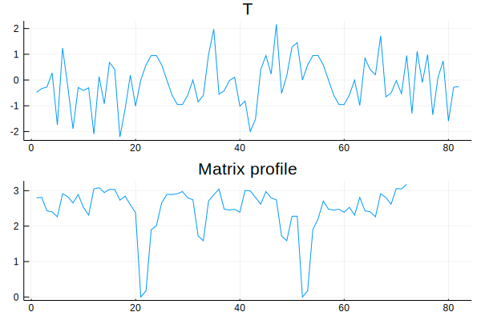

# MatrixProfile

[](https://github.com/baggepinnen/MatrixProfile.jl/actions)
[](https://codecov.io/gh/baggepinnen/MatrixProfile.jl)

Time-series analysis using the matrix profile. The matrix profile `P` tells you which sub-sequences of a time series `T` are similar to each other, and which are most dissimilar from all other. This will allow you to find repeated patterns, or *motifs*, as well as finding outliers.

The function `stomp` returns the matrix profile and profile indices. Here's an example where we insert a repeated pattern in an otherwise random time series.
```julia
t   = range(0, stop=1, step=1/10)
y0  = sin.(2pi .* t)
T   = [randn(20); y0; randn(20); y0; randn(20)]
window_length = length(y0)
P,I = stomp(T, window_length)
plot(T, layout=(2,1), title="T", legend=false, link=:x)
plot!(P, sp=2, title="Matrix profile", legend=false) # Should have minima at 21 and 52
```

The matrix profile have two sharp minima at the onset of the repeated pattern. The parameter `window_length` determines how long pattern to search for.

`stomp` benefits greatly in speed from the use of `Flaot32` instead of `Float64`. The computational time scales as the square of the length of `T`, but is invariant to the window length. Calculating the matrix profile of `2^17 ≈ 100k` points takes about a minute on a laptop.

Reference: [Matrix profile II](https://www.cs.ucr.edu/~eamonn/STOMP_GPU_final_submission_camera_ready.pdf).
